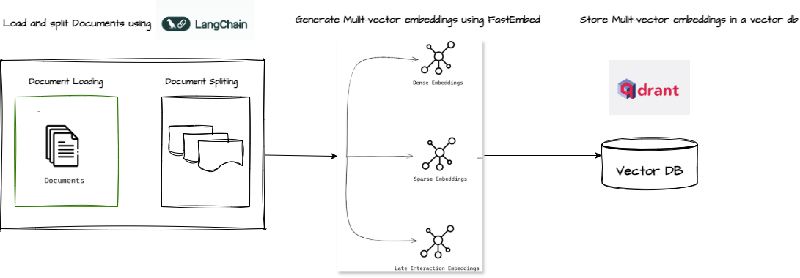
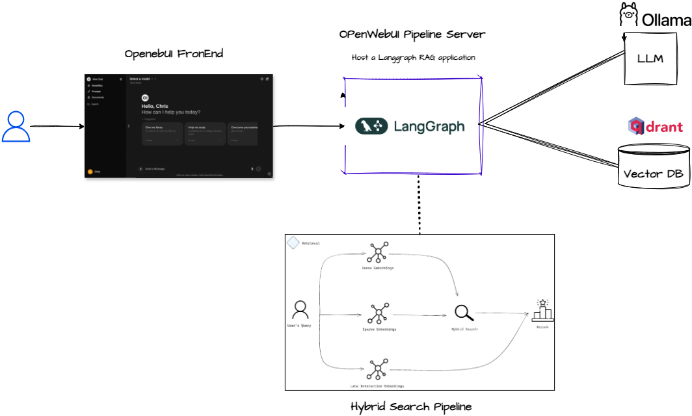

# Hybrid Search RAG

## 📷 Sample Conversations Screenshots

**Text**

<p align="center">
  
</p>


**Voice**

<p align="center">
  
</p>


## Architecture

**Ingestion**


<p align="center">
  
</p>

**Serving**


<p align="center">
  
</p>

Ref : https://qdrant.tech/documentation/search-precision/reranking-hybrid-search/

## Setup

**Prerequisites**

- Docker
- Conda/Miniconda

### Components

**Architecture Components**

The following components needs to be installed for this
- Ollama ( For Serving LLM models )
- Qdrant ( Vector Database )
- Open WebUI ( Chatbot UI )

**Ollama Setup**

Install Ollama : See https://ollama.com/

Pull an LLM Model

```shell
ollama pull llama3.1:8b
```

Note: For this excercise, please use a model which supports tool calling.

**Qdrant VectorDB**

See : [Qdrant Vector DB](docs/VectorDB.md)

**Open WebUI**

See : [Open WebUI](docs/OpenWebUI.md)

### Code

**Prerequisites**

Create a new python environment & install dependencies

```shell
## Create new enviroment
conda create -n gen_ai_demo python=3.11

## Activate the environment
conda activate gen_ai_demos

## Intall the dependencies 
pip install -r requirements.txt
```

Launch JupyterLab `jupyter lab`

**Step 1: Pre-download all embedding models locally to a specific path**

Run the notebook `Download_Embedding_Models.ipynb`

**Step 2: Ingest Data to Vector DB**

Before running this notebook, ensure that Qdrant DB is running.

Run the notebook `Qdrant_Hybrid_ETL.ipynb`

**Step 3: Install the OpenWeb UI Piplelines Project**

For hosting & serving our app, we shall be using the [Pipelines](https://docs.openwebui.com/pipelines) project, to make it easy to integate withe fantastic [OpenWebUI](https://openwebui.com/) frontend.

Clone the repo: `git clone https://github.com/open-webui/pipelines.git`

Copy the `apps` folder from this project to the root folder of the `pipelines` project. So the directory structure would look something like :

```shell
.
├── CONTRIBUTING.md
├── Dockerfile
├── LICENSE
├── README.md
├── apps
...
├── main.py
├── pipelines
...
```

Then copy the file `pipelines` under the `pipelines` folder.

Finally, start the pipelines server :

```shell
## Activate the enviromnent
conda activate gen_ai_demos

## For Windows
start.bat

## For Linux
bash ./start.sh
```

**Step 4: Integrate the Open WebUI and Pipelines**

## UIs

- Qdrant Vector store: http://localhost:6333/dashboard
- Open Web UI :  http://localhost:3000/

## References

- https://qdrant.tech/documentation/search-precision/reranking-hybrid-search/


```python
multiply.invoke({"x": 4, "y": 5})
```
### Example with Agent

```python
from langchain_core.tools import tool
from langchain_ollama import ChatOllama
from langchain.agents import AgentExecutor, create_tool_calling_agent
from langchain_core.prompts import ChatPromptTemplate

@tool
def multiply(x: float, y: float) -> float:
    """Multiply 'x' times 'y'."""
    return x * y

@tool
def exponentiate(x: float, y: float) -> float:
    """Raise 'x' to the 'y'."""
    return x**y

@tool
def add(x: float, y: float) -> float:
    """Add 'x' and 'y'."""
    return x + y

tools = [multiply, exponentiate, add]

## Initialize a chat model
llm_name = "llama3.1:8b"
llm = ChatOllama(
    base_url="http://localhost:11434",
    model=llm_name,
    temperature=0,
    num_predict=500,
    tfs_z=0.8,
    top_k=30,
    top_p=0.6
)

# Prompt for creating Tool Calling Agent
prompt = ChatPromptTemplate.from_messages(
    [
        (
            "system",
            "You are a helpful assistant.",
        ),
        ("placeholder", "{chat_history}"),
        ("human", "{input}"),
        ("placeholder", "{agent_scratchpad}"),
    ]
)

# Construct the Tool Calling Agent
agent = create_tool_calling_agent(llm, tools, prompt)

# Create an agent executor by passing in the agent and tools
agent_executor = AgentExecutor(agent=agent, tools=tools)

# Run Agent
query = "What is 3 times 12?"

response = agent_executor.invoke({"input": query})
```


